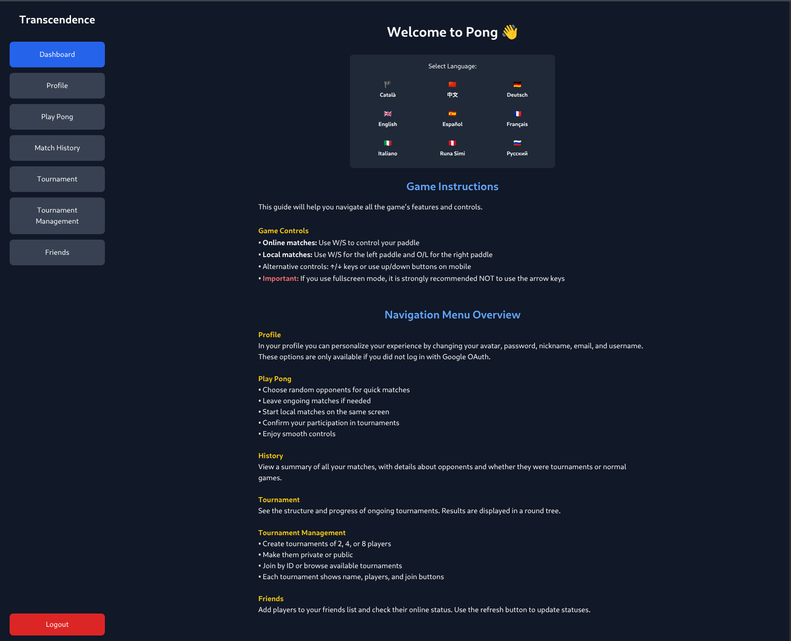
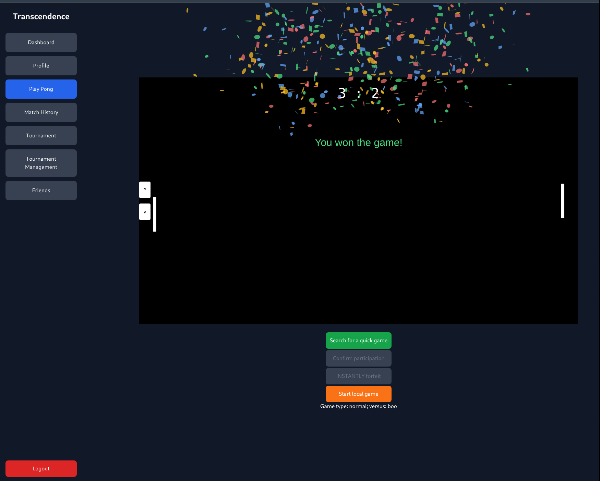
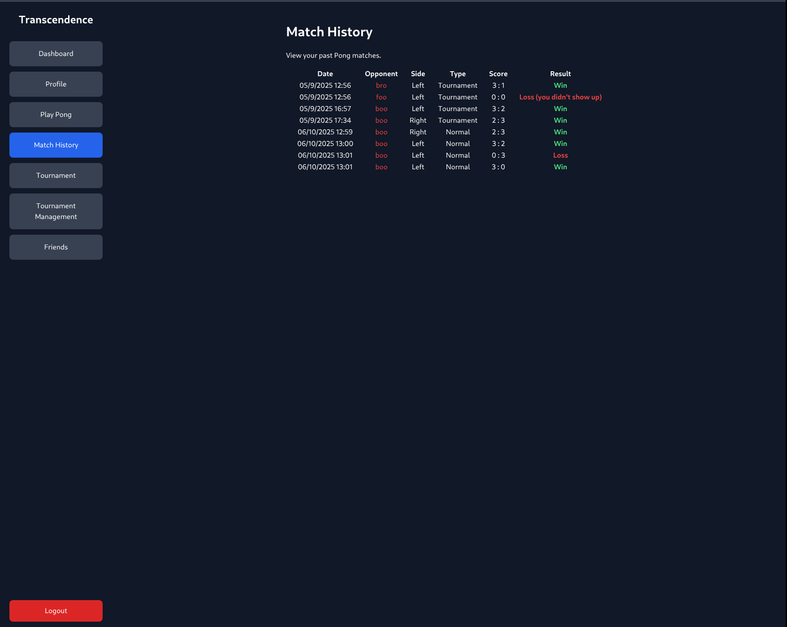

# ft_transcendence

A modern web-based Pong game platform with real-time multiplayer capabilities, user management, and tournament features. Built as part of the 42 School curriculum using a microservices architecture.

## 🎯 Features

- **Real-time Pong Game**: Classic Pong gameplay with modern web technologies
- **Multiplayer Support**: Play against other users in real-time
- **Tournament System**: Organize and participate in tournaments
- **User Management**: Registration, authentication, and profile management
- **Friends System**: Add friends and track their activities
- **Game History**: Track your game statistics and match history
- **Internationalization**: Multi-language support (i18n)
- **Responsive Design**: Works on desktop and mobile devices

## 🏗️ Architecture

This project follows a microservices architecture:

- **Frontend**: TypeScript/Vite SPA with TailwindCSS
- **API Gateway**: Fastify-based gateway with JWT authentication and rate limiting
- **User Management Service**: Handles user registration, authentication, and profiles
- **Game Service**: Manages game logic, matchmaking, and real-time communication
- **Logging**: ELK Stack integration for monitoring and analytics

## 🚀 Quick Start

### Prerequisites

- Docker and Docker Compose
- Make (optional, for easier commands)

### Running the Application

1. Clone the repository:
```bash
git clone https://github.com/albertpardo/ft_transcendence.git
cd ft_transcendence
```

2. Start the application:
```bash
make all
# or alternatively
docker compose up -d --build
```    

3. Access the application:
   - **Frontend**: https://localhost:3000
   - **API Gateway**: https://localhost:8443      
     you will have to visit the API Gatway and follow through to accept the risks of the self signed certificates.

### With ELK Stack (Logging)

1. Create a `.env` file with ELK configuration
2. Run with ELK stack:
```bash
make elk
```

## 🛠️ Development

### Available Commands

```bash
make all          # Start all services
make elk          # Start with ELK stack
make down         # Stop services
make clean        # Clean up containers and images
make fclean       # deeper cleaning
make status       # Show system status
make re           # rebuild everything
```

### Project Structure

```
ft_transcendence/
├── frontend/                 # TypeScript/Vite frontend
│   ├── src/
│   │   ├── views/           # Page components
│   │   ├── router.ts        # Client-side routing
│   │   └── i18n.ts         # Internationalization
├── backend/
│   ├── api-gateway/         # Fastify API gateway
│   └── microservices/
│       ├── user_management/ # User service
│       └── game_service/    # Game logic service
├── docker-compose.yml       # Main compose file
└── Makefile                # Development commands
```

## 🎮 Game Features

- **Classic Pong Gameplay**: Smooth paddle controls and ball physics
- **Real-time Multiplayer**: WebSocket-based real-time communication
- **Tournament Mode**: Bracket-style tournaments with multiple players
- **Matchmaking**: Automatic player matching for games
- **Spectator Mode**: Watch ongoing games
- **Game Statistics**: Track wins, losses, and performance metrics

## 📸 Screenshots


*register*


*login*


*dashboard*


*profile*




*game*



*macth history*


## 🔧 Technical Stack

### Frontend
- **TypeScript**: Type-safe JavaScript
- **Vite**: Fast build tool and dev server
- **TailwindCSS**: Utility-first CSS framework
- **i18next**: Internationalization framework
- **Canvas**: Game rendering

### Backend
- **Node.js**: Runtime environment
- **Fastify**: High-performance web framework
- **TypeScript**: Type-safe server-side code
- **JWT**: Authentication tokens
- **WebSockets**: Real-time communication
- **Pino**: Structured logging

### Infrastructure
- **Docker**: Containerization
- **Docker Compose**: Multi-container orchestration
- **ELK Stack**: Elasticsearch, Logstash, Kibana (optional)

## 📊 Monitoring

The application includes comprehensive logging and monitoring:

- **Structured Logging**: JSON-formatted logs with Pino
- **ELK Stack Integration**: Centralized log aggregation and analysis
- **Health Checks**: Service health monitoring
- **Performance Metrics**: Request timing and throughput tracking

## 🔐 Security

- **HTTPS**: TLS encryption for all communications
- **JWT Authentication**: Secure token-based authentication
- **Rate Limiting**: API request rate limiting
- **CORS Configuration**: Cross-origin request security
- **Input Validation**: Server-side input sanitization

## 🌐 API Endpoints

The API gateway exposes the following endpoints:

- `GET /api/users` - Get all users
- `GET /api/users/id/:id` - Get user by ID
- `GET /api/users/name/:name` - Get user by name
- `POST /api/users` - Create new user
- `PUT /api/users/id/:id` - Update user
- `DELETE /api/users/id/:id` - Delete user

For detailed API documentation, visit the API gateway at `https://localhost:8443/api`

## 🤝 Contributing

1. Fork the repository
2. Create a feature branch: `git checkout -b feature/amazing-feature`
3. Commit your changes: `git commit -m 'Add amazing feature'`
4. Push to the branch: `git push origin feature/amazing-feature`
5. Open a Pull Request

## 📚 Resources

- **Project Wiki**: https://github.com/albertpardo/ft_transcendence/wiki


## 📝 License

This project is part of the 42 School curriculum and is intended for educational purposes.

## 👥 Authors

- **Albert Pardo** - [@albertpardo](https://github.com/albertpardo)
- **BorisMichaelRandebrock** - [@BorisMichaelRandebrock](https://github.com/BorisMichaelRandebrock)
- **DISN-kolo** - [@DISN-kolo](https://github.com/DISN-kolo)
- **Lin Yao** - [@Hazeliny](https://github.com/Hazeliny)
- **Carlos A.** - [@xilen0x](https://github.com/xilen0x)

---

*Built with ❤️ at 42 Barcelona*
